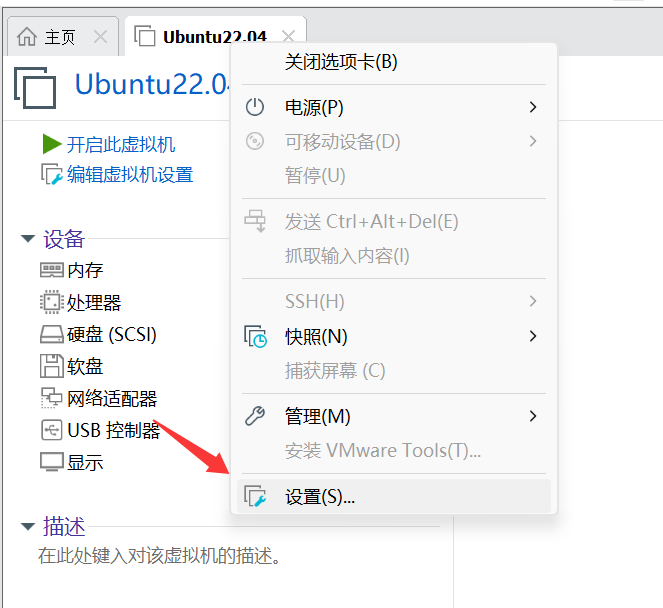
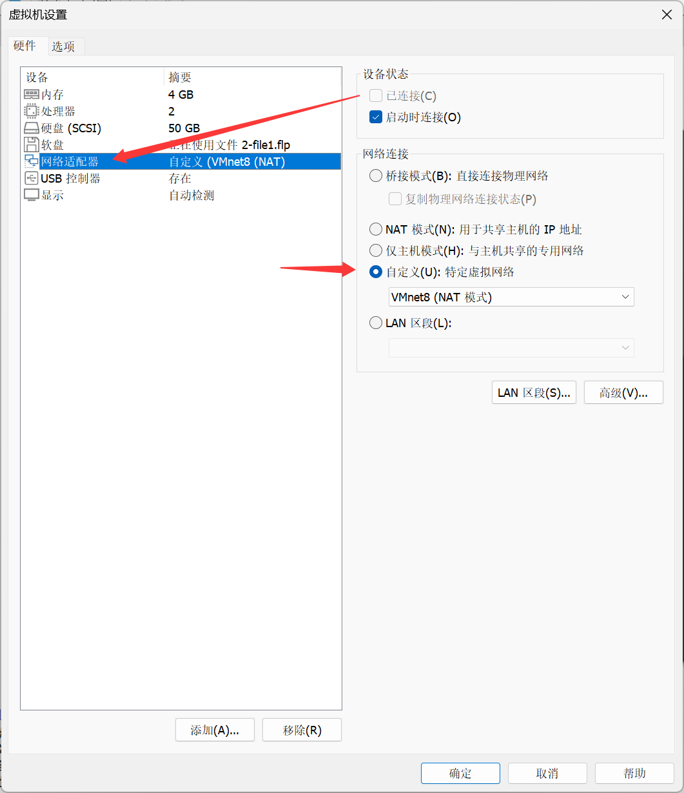

### 前言：

如果你是刚入门pwn的小白，正想要搭建一个适合打pwn的虚拟机环境，那么这篇文章或许可以为你提供一些指导。

##### *注：序号前标* `*`的为选择性安装


### 1 下载&安装VMware Workstation及Ubuntu22.04镜像文件

VMware Workstation官网：https://www.vmware.com/

Ubuntu22.04镜像文件( ubuntu-22.04.5-desktop-amd64.iso)下载链接：[Ubuntu 22.04.5 LTS (Jammy Jellyfish)](https://www.releases.ubuntu.com/22.04/)()


### 1.5 VM虚拟机网络配置

**笔者最开始配置虚拟机时，在虚拟机网络配置这块遇到了点问题，因此在这里给出自己解决虚拟机网络连接问题的方案，仅供参考*

vm虚拟机设置 >> 点击网络适配器 >> 自定义 >> 选择VMnet(NAT模式)





### 2 更新软件源

```
sudo apt update
sudo apt upgrade
```


### 3 安装vmtools

一般来说，当你刚入手一个虚拟机时，主机和虚拟机之间是不能复制粘贴内容的。为了解决这个问题，我们需要安装一个工具：vmtools

```
sudo apt-get install open-vm-tools
sudo apt-get install open-vm-tools-desktop
```

安装完成之后重启虚拟机

```
sudo reboot
```

（注：虚拟机终端的复制粘贴热键为shift+ctrl+c/v）


### 4 安装vim和gedit

```
sudo apt install vim 
sudo apt install gedit
```

*如果是初次使用vim，需要知道几个基础按键：按`i`进入编辑，按`esc`退出编辑，按`:`并输入`wq`保存并退出；`:q!`不保存强制退出


### 5 更换镜像源

```
cd /etc/apt  # 进入 apt 目录下
sudo cp sources.list sources.list.backup  # 备份
sudo vim sources.list  # 编辑 sources.list 文件

# 在原文件内容末尾添加下面两个----之间的内容
-----------------------------------------------------------------
# 默认注释了源码镜像以提高 apt update 速度，如有需要可自行取消注释
deb https://mirrors.tuna.tsinghua.edu.cn/ubuntu/ jammy main restricted universe multiverse
# deb-src https://mirrors.tuna.tsinghua.edu.cn/ubuntu/ jammy main restricted universe multiverse
deb https://mirrors.tuna.tsinghua.edu.cn/ubuntu/ jammy-updates main restricted universe multiverse
# deb-src https://mirrors.tuna.tsinghua.edu.cn/ubuntu/ jammy-updates main restricted universe multiverse
deb https://mirrors.tuna.tsinghua.edu.cn/ubuntu/ jammy-backports main restricted universe multiverse
# deb-src https://mirrors.tuna.tsinghua.edu.cn/ubuntu/ jammy-backports main restricted universe multiverse
deb https://mirrors.tuna.tsinghua.edu.cn/ubuntu/ jammy-security main restricted universe multiverse
# deb-src https://mirrors.tuna.tsinghua.edu.cn/ubuntu/ jammy-security main restricted universe multiverse
-----------------------------------------------------------------
```


### 6 安装git

```
sudo apt install git
```


### 7 安装&更新pip

```
sudo apt install python3-pip
pip3 install --upgrade pip
```


### 7.5 更换pip源

```
pip config set global.index-url https://pypi.tuna.tsinghua.edu.cn/simple
```


### 8 安装32位库

```
sudo dpkg --add-architecture i386
sudo apt update
sudo apt install libncurses5-dev lib32z1
sudo apt install libc6:i386 libstdc++6:i386
```


### 9 安装Capstone

```
sudo git clone https://github.com/capstone-engine/capstone.git /opt/capstone
cd /opt/capstone
sudo make -j$(nproc)
sudo make install
sudo ldconfig  # 刷新系统动态链接库
```

验证：

```
ls /usr/lib | grep capstone
```

看到以下内容即为安装成功：

```
libcapstone.a
libcapstone.so
libcapstone.so.6
```


### 10 安装pwntools

```
sudo python3 -m pip install pwn
```


### 11 安装gdb

一般系统会自带gdb，可以先在终端输入 `gdb` 验证一下,没有的情况下再自行安装

```
sudo apt install gdb
```


### 12 安装gdb-multiarch

```
sudo apt install gdb-multiarch
```


### 13 安装pwndbg

```
sudo apt update
sudo git clone https://github.com/pwndbg/pwndbg /opt/gdb_plugins/pwndbg
cd /opt/gdb_plugins/pwndbg
sudo ./setup.sh
```

在使用pwndbg的时候可能会遇到自动依赖更新后的权限问题，因此这里建议关闭Pwndbg的自动依赖更新

```
vim ~/.bashrc
##将下面这一行写入 ~/.bashrc
export PWNDBG_NO_AUTOUPDATE=1
```

保存并退出后输入：

```
source ~/.bashrc
```


### 14 安装pwngdb

```
sudo git clone https://github.com/scwuaptx/Pwngdb.git /opt/gdb_plugins/Pwngdb
cd /opt/gdb_plugins/Pwngdb
sudo cp .gdbinit ~/
sudo vim ~/.gdbinit
```

在 `define hook-run` 这一句的前面的4行语句删掉，插入这三行

```
source /opt/gdb_plugins/pwndbg/gdbinit.py
source /opt/gdb_plugins/Pwngdb/pwngdb.py
source /opt/gdb_plugins/Pwngdb/angelheap/gdbinit.py
```


### 15 安装LibcSearcher

```
pip3 install LibcSearcher -i https://pypi.tuna.tsinghua.edu.cn/simple
```


### 16 安装one_gadget

```
pip3 install LibcSearcher -i https://pypi.tuna.tsinghua.edu.cn/simple
```


### 17 安装glibc-all-in-one

```
sudo git clone https://github.com/matrix1001/glibc-all-in-one.git /opt/glibc-all-in-one
cd /opt/glibc-all-in-one
```

以下是glibc-all-in-one简单使用指南

a.安装成命令行工具：

```
sudo pip3 install -e .  #报错的直接看下面解决方案
```

*补充：笔者在实操的时候遇到了以下问题：

```
Obtaining file:///opt/glibc-all-in-one
  Installing build dependencies ... done
  Checking if build backend supports build_editable ... done
ERROR: Project file:///opt/glibc-all-in-one has a 'pyproject.toml' and its build backend is missing the 'build_editable' hook. Since it does not have a 'setup.py' nor a 'setup.cfg', it cannot be installed in editable mode. Consider using a build backend that supports PEP 660.
```

原因是环境的 setuptools版本太旧，不支持 PEP 660 要求的 `build_editable hook`

解决方法：下载高版本setuptools，并绕过pip隔离构建使用下载的高版本setuptools安装即可

```
sudo pip3 install --upgrade setuptools wheel
sudo pip3 install -e . --no-build-isolation 
```

b.拉取列表：

```
sudo glibc-aio mirror update
```

c.查看镜像源&关键词查找：

```
glibc-aio mirror list
glibc-aio search 2.27
```


d.下载指定版本(以2.27-3ubuntu1_amd64为例)：

```
sudo glibc-aio download 2.27-3ubuntu1_amd64
```

只要 libc，不要 debug 符号

```
sudo glibc-aio download 2.27-3ubuntu1_amd64 --no-dbg
```

指定镜像

```
sudo glibc-aio download 2.27-3ubuntu1_amd64 --mirror tuna
```

下载好的位置：`libs/2.27-3ubuntu1_amd64/x86_64-linux-gnu/libc.so.6`

*还有其他的功能请自行摸索（


### 18 安装patchelf

```
sudo apt install patchelf
```


### 19 安装main_arena_offset

```
sudo git clone https://github.com/IZAY01/py_main_arena_offset /opt/py_main_arena_offset
cd /opt/py_main_arena_offset
sudo python3 setup.py develop
```

使用示例：

```
from pymao import *

libc = "./libc-2.27.so"
main_arena_offset = gmao(libc)
# or main_arena_offset = get_main_arena_offset(libc)
```


### 20 安装seccomp-tools

```
sudo apt install gcc ruby-dev
sudo gem install seccomp-tools
```


### *21 安装qemu-system

```
sudo apt-get install qemu-system
```


### *22 安装ropper

```
sudo pip3 install capstone filebytes unicorn keystone-engine ropper
```


### 23 安装Alpha3 & AE64

Alpha3：

```
sudo git clone https://github.com/TaQini/alpha3.git /opt/alpha3
cd /opt/alpha3
```

安装 `gcc-multilib` 以支持编译 32 位程序

```
sudo apt install gcc-multilib
```

AE64：

```
sudo pip3 install z3-solver #安装依赖
sudo git clone https://github.com/veritas501/ae64.git /opt/ae64
cd /opt/ae64
sudo python3 setup.py install
```

（虽然这俩比较少用到但是还是装一下吧）


### *24 配置 pwndbg 分屏调试 (选择性配置)

注：以下配置可以先暂时不做配置，等你用一段时间pwndbg调试之后觉得单窗口同时输指令+看内容不太方便时可以尝试一下


首先在虚拟机内先后打开两个终端，分别输入`tty`

输出/dev/pts/0的是你先打开的终端，输出/dev/pts/1的则是你后打开的终端

这里选择先打开的一个终端用于开启 gdb 调试并输入调试命令，后打开的一个终端用于输出调试信息

修改 `~/.gdbinit` 中的内容：

```
sudo vim ~/.gdbinit
```

在 `~/.gdbinit` 末尾加入一句：

```
set context-output /dev/pts/1
```

设置分屏后，如果只开启一个终端，使用 gdb 可能会遇到如下报错：

```
Exception occurred: context: [Errno 13] 权限不够: '/dev/pts/20' (<class 'PermissionError'>)  
For more info invoke `set exception-verbose on` and rerun the command  
or debug it by yourself with `set exception-debugger on`
```

再开启一个终端即可解决 （新开启的终端需为 /dev/pts/1）


### 结语：

本文章参考或引用了以下几篇师傅的文章或相关资料内容，在此表示感谢orz

(排序不分先后)

[Ubuntu22.04的环境配置（CTF-PWN） | Icyice's Corner](https://icyice001.github.io/2025/07/29/Ubuntu22.04的环境配置（CTF-PWN）/)

[pwn环境配置 | starrysky](https://starrysky1004.github.io/2024/10/05/pwn-huan-jing-pei-zhi/#toc-heading-12)

[★pwn 22.04环境搭建保姆级教程★_pwn环境搭建-CSDN博客](https://blog.csdn.net/j284886202/article/details/134931709)
