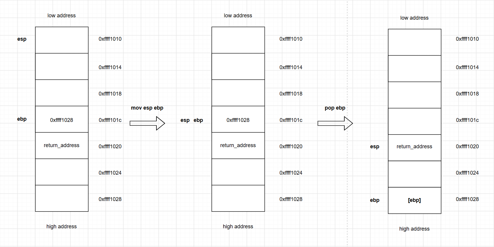
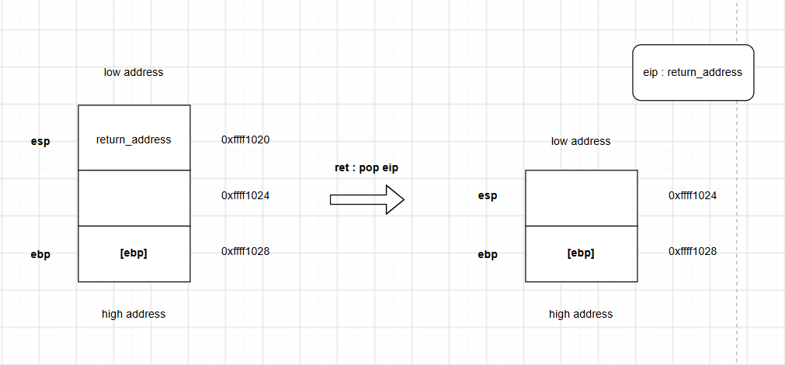
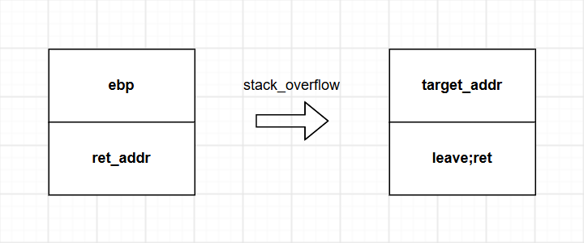

#### 前言

在笔者最开始学习栈迁移的时候，其中的汇编原理让我困惑了一段时间。于是笔者试着整理一下有关栈迁移的知识点，逐步分析一下栈迁移发生时的过程从而有助于理解这一攻击手法。

#### 知识基础

1.汇编语言基础。需要了解寄存器在程序运行时的变化及leave、ret这两个基础汇编指令的原理。

2.对栈的结构有初步认识，同时对程序中函数调用与结束时栈上的变化也有一定了解。

#### 栈迁移的概念及利用条件

###### 1.什么是栈迁移？

栈迁移是当输入空间受到限制，原栈上无法布置完整ROP链时，通过劫持栈指针到另一段可控的内存空间上，以便能够执行更长的ROP链并最终控制程序执行流程的一种技术。

###### 2.栈迁移的利用条件是什么？

当你在程序中找到一段可以进行栈溢出的代码时，细一看发现允许输入数据的最大空间不足以写入完整的payload来getshell，最多只能覆盖到rbp或者ret_addr，这个时候就需要栈溢出技术来"移位"到其他地方从而写入更多数据了。

总而言之，想要利用栈迁移，要满足以下条件：

1.能够实现栈溢出（最起码要能够覆盖掉rbp）。

2.有个能写入数据的地方。bss段优先考虑，其次是栈上的某个位置。

#### leave;ret的原理分析

开始之前，先说明一下： **ebp** 与  **ebp的内容** 是两个东西：`ebp` 是保存当前栈帧基址的寄存器值，它通常是一个地址，而 `ebp的内容` 是这个地址指向的内存里的内容(通常程序正常运行下也是地址，但是要进行溢出时你可以将其覆盖成非地址内容)。两者关系可以类比成c语言中的指针p与*p。因此，以防混淆二者，后文部分 **ebp的内容** 用  **[ebp]** 代指。

要理解栈迁移，弄懂这条汇编指令至关重要：**leave；ret**

可以将其拆分成两部分逐步理解。

###### 1.leave

`leave`可以拆分成两部分：

a. **MOV ESP, EBP**：将栈指针（ESP）恢复到帧指针（EBP）的值，释放局部变量占用的空间。

b. **POP EBP**：从栈中弹出旧的帧指针，恢复调用者的帧环境。

步骤a：先将 esp 指向 ebp (也可以理解成把ebp赋给esp)，从而使esp与ebp位于了一个地址。此时，便于理解可以把指向的这个地址当做既是栈顶又是栈底

步骤b：将 栈顶的内容 弹入 ebp 。由于esp时刻指向栈顶，所以当栈顶内容弹走时，esp自然要往下(高地址)移动一个内存单元。

通俗的讲，ebp在执行完这一步后会直接被覆盖成原栈顶保存的内容（不准确的讲ebp就相当于跳转到原栈顶里放的地址处了。这么说主要是便于理解，实际上是ebp的值改变引起的从原栈上位置处到栈顶保存的地址处的移动）

过程如图所示：

###### 2.ret

`ret`等效于**pop eip**，即:将栈顶内容弹入eip(eip是用来保存下一条要执行指令地址的寄存器，也就是说ret之后就马上跳转到栈顶内容里保存的地址处接着执行指令)。栈顶内容弹走后，指向原栈顶的esp往下(高地址)移动一个内存单元，指向新的栈顶

如图：

弄懂这条指令后，接下来就可以接着理解栈迁移的原理了。

#### 栈迁移的利用步骤

栈迁移的利用简单来说可以归结为一句话：利用栈溢出将原栈上保存的旧ebp的内容覆盖成需要迁移到的位置的地址，然后接着将返回地址覆盖成leave;ret指令的地址；然后在我们迁移到的位置上，就可以构造如system("/bin/sh")等来getshell了。

我们讲这句话逐步拆解来详细分析：

1.首先，在确保栈溢出能覆盖掉ebp、ret_addr之后，将栈帧中保存的旧ebp值修改为我们要迁移到的目标位置的地址，再将ret_addr修改为leave;ret指令地址。

这样，在程序执行流到第一个leave;ret时，进行的实际上是以下步骤：

a.首先执行 mov esp,ebp 。此时ebp和esp指向同一地址处，该处此刻既为栈顶也为栈中保存旧ebp的位置(当然，此时该位置已经被覆盖为了目标地址)。

b.之后执行pop ebp，将栈顶内容弹入ebp，之后ebp寄存器指向的地址就变成了我们精心构造的目标地址了。

c.然后再执行ret（看作pop eip）。当第一个leave执行完后，此时esp向高地址移动了一个内存单元，栈顶内容变为了通过栈溢出覆盖的leave;ret指令的地址(即原来的ret_addr)。所以，当执行ret时，leave;ret指令被弹入eip，因此程序执行流的下一条所要执行的指令就变为了leave;ret。到这里，第一个leave;ret结束。

2.接下来，程序执行流到了第二个leave;ret。因为第一个leave;ret执行的时候我们通过栈溢出将原栈顶内容覆盖为了要迁移到的目标地址。因此，第二个leave;ret开始执行的时候，ebp已经指向构造好的目标地址。

a.执行mov esp,ebp。esp和ebp指向同一地址(即目标地址)。到这一步，esp就成功被我们"骗"到了另外一处内存空间，整个程序的栈空间成功完成"迁移"。

b.然后执行pop ebp，将新的栈顶无用的内容弹出(注意，由于pop ebp要弹出一个内存单元的内容，因此构造ROP链时记得空出来一内存单元的无用数据以供弹出)，同时esp移动到高地址的一内存单元处。esp移动到的地方(新的栈顶处)，实际就是我们精心构造的ROP链开头了(如图中的system@plt地址处)。

c.最后，执行ret，将此刻栈顶的内容(system@plt)弹进eip，接着程序执行流就会跳转到system@plt，紧接着就可以getshell了。

#### 结语

以上即为笔者在学习栈迁移时整理总结的知识点，如有疏漏或错误敬请指正(

（本文章参考或引用了以下几篇师傅的文章或相关资料内容，在此表示感谢orz）

（排序不分先后）

[栈迁移的原理&&实战运用 - ZikH26 - 博客园](https://www.cnblogs.com/ZIKH26/articles/15817337.html)

[栈迁移原理深入理解以及实操-先知社区](https://xz.aliyun.com/news/12184)
